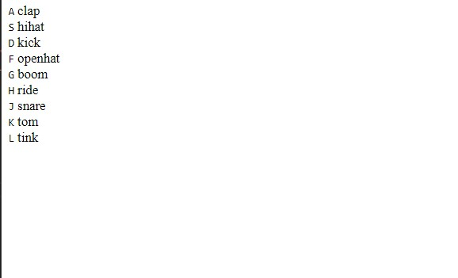

# CHALLENGE DAY 1
---

Last Update| Changes Applied
---|---
02-05-2021| Finished Day 1

## DRUM KIT
The main points worked in this projecte are:

### 1. HTML

I can highligth the use of **audio** label and **data-** label.

### 2. CSS

In the style.css sheet we need to use these properties:

* Object: flex; display; align-items
* Fonts: vhn and rm for fonts
* Shadows: text-box; box-shadow

### 3. Javascript

In Js the main points exposed are:

a) using jqueryselectors.

A quick overview of how the project was developed is here:

### The first stage. Only HTML code.

### Second stage. Using *SOME CSS code.

### THIRD stage. Using *COMPLETE CSS code.
> No Background image here

> **With background Image here**

### FOURTH stage. Project completed with JS.

## Bugs founded in my project
> these are in review and looking for improvements and how to fix it.
* when there is a key pressed for long time the highgligt box goes freezed.
* the letter is positioned next to the name of th sound, it should be on top.
